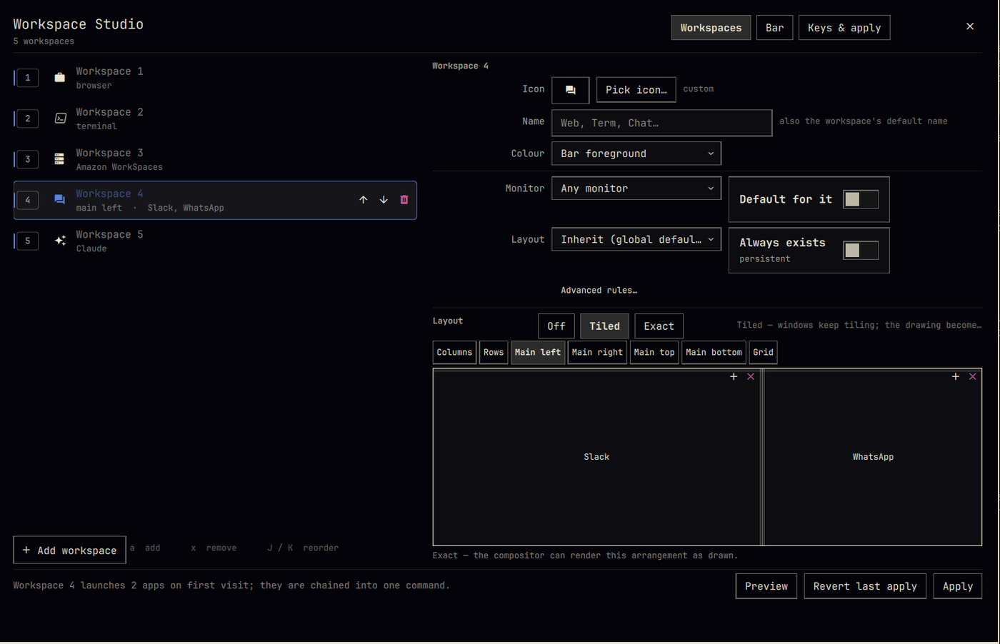

# Workspace Studio

An Omarchy shell plugin that turns "how many workspaces do I have, what is each
one called, what icon does it get, and which apps live there" into a screen you
can actually use — instead of three hand-edited Lua files and a cloned bar
widget.

It ships two things:

- **A bar widget** that draws one button per workspace with your icon and name.
  Left click focuses. Right click opens the editor.
- **An editor overlay** that writes the Hyprland config for you: workspace
  rules, window rules, launches and the `SUPER+N` keybinds.



## Install

```bash
omarchy plugin add https://github.com/majinmarco/omarchy-workspace-studio.git --enable
```

That clones the repo into `~/.config/omarchy/plugins/majinmarco.workspace-studio/`,
validates the manifest, and puts the widget on the left of your bar.

You almost certainly already have a workspace indicator there. Two of them look
silly, so remove the old one:

```bash
# the stock indicator
omarchy plugin disable omarchy.workspaces

# or, if you cloned it into your own widget
omarchy plugin disable <yourname>.workspaces
```

Then restart the shell so the new widget is drawn:

```bash
omarchy restart shell
```

To put it somewhere specific instead of the default:

```bash
omarchy plugin enable majinmarco.workspace-studio --section left --after omarchy.menu
```

### Opening the editor

Right click any workspace button. Or from a terminal:

```bash
omarchy-shell shell toggle majinmarco.workspace-studio '{}'
```

Or give it a key — this goes in **your** `~/.config/hypr/bindings.lua`; the
plugin will not write it for you:

```lua
o.bind("SUPER + SHIFT + W", "Workspace Studio",
  "omarchy-shell shell toggle majinmarco.workspace-studio '{}'")
```

## First run

If you already have a layout in `~/.config/hypr`, the editor offers to import it
on first open. It reads:

| Source | What it takes |
|---|---|
| `~/.config/hypr/hyprland.lua` | `o.window(...)` / `hl.window_rule(...)` rules that pin a class to a workspace |
| `~/.config/hypr/autostart.lua` | `o.launch_on_start` / `o.exec_on_start`, including `local` variables, `o.launch()` wrappers and `sleep N &&` prefixes |
| `~/.config/omarchy/plugins/<you>.workspaces/Workspaces.qml` | the hard-coded icon map, if you cloned the stock widget |

It attaches each launch to the window rule it belongs to by predicting the
class Chromium gives a web app, so a `--app=https://web.whatsapp.com/` launch
finds its `chrome-web.whatsapp.com__-Profile_2` rule on its own.

**The wizard never edits those files.** It prints the exact lines it read, with
line numbers, and asks you to remove them yourself — otherwise every window
rule is registered twice and every app launches twice. Importing fills the
editor in; nothing reaches Hyprland until you press **Apply**.

The wizard also offers to convert your `exec-once` ladder into
`on_created_empty`, so apps start the first time you visit their workspace
instead of racing each other at login. That is the recommended setting: no boot
cost, no `sleep` ladder, and the window rules still route everything.

## What it writes

Two files, both owned entirely by this plugin, both written only when you press
Apply:

| File | Why |
|---|---|
| `~/.config/omarchy/workspace-studio.json` | The source of truth. Human-readable, documented by `config.schema.json`, and safe to hand-edit or keep in your dotfiles. |
| `~/.local/state/omarchy/toggles/hypr/zz-workspace-studio.lua` | The compiled Hyprland fragment. Generated, disposable, regenerable from the JSON at any time. |

The `.lua` file goes in Omarchy's own state directory for auto-sourced Hyprland
config: `~/.config/hypr/hyprland.lua` ends with
`require("default.hypr.toggles")`, which loads every `*.lua` in that folder on
every reload. The `zz-` prefix sorts it last, so its unbinds win over anything
declared earlier. `omarchy refresh hyprland` leaves it alone.

The bar's own look — icon size, spacing, what the focus indicator does — is not
in either file. It lives inline on the plugin's entry in
`~/.config/omarchy/shell.json`, the same place `omarchy bar set` writes:

```bash
omarchy bar set majinmarco.workspace-studio focusStyle marker
omarchy bar set majinmarco.workspace-studio showNames true
```

Everything in `manifest.json`'s `barWidget.schema` is settable that way, and the
editor's **Bar** tab is the same set with labels. Those changes take effect
immediately — no reload of anything.

**Nothing else of yours is ever written.** Not `~/.config/hypr/*.lua`, not your
bar layout, not your keybindings file.

## Applying

Press **Preview** first: it shows the generated Lua diffed line by line against
what is on disk. **Apply** writes the two files and then runs
`bin/workspace-studio-apply`, which:

1. `hyprctl reload config-only` — rebuilds rules and binds from scratch.
2. `hyprctl configerrors` — must come back clean.
3. `hyprctl binds -j | jq '[.[]|select(.key=="" and .keycode==0)]|length'` — must
   be `0` (see "The keybind trap" below).
4. Checks that no workspace key is bound twice.

Anything wrong raises a desktop notification and a non-zero exit. **Revert last
apply** swaps the previous generated file back and reloads again.

A full reload (instead of `config-only`) also re-applies your monitor config.
That is available in the **Keys & apply** tab but is not the default, because on
laptops it can relight a panel under a closed lid.

### Does applying relaunch my apps?

**No.** Measured on Hyprland 0.56.2: `hyprctl reload` and
`hyprctl reload config-only` both re-execute the config chunk and fire
`config.reloaded`, but they do **not** fire `hyprland.start`. Since
`o.exec_on_start` / `o.launch_on_start` are `hl.on("hyprland.start", ...)`
handlers, apps set to "start at login" stay put when you apply. The generator
therefore carries no re-entry guard.

(The probe: a temporary `zz-ws-probe.lua` in the toggles directory that appended
to a file under `$XDG_RUNTIME_DIR` from each of the two handlers. Across three
reloads the chunk ran three times and `config.reloaded` fired three times;
`hyprland.start` never fired.)

### The keybind trap

Hyprland 0.56.2 silently fails to parse `code:NN` bind keycodes. They land in
the bind table with `key: ""` and `keycode: 0`, and then match on the **modifier
mask alone** — so one `SUPER`+anything press fires every bind that shares that
mask, and you get a workspace sweep from 1 to 10.

Omarchy's stock bindings declare all ten workspaces by keycode, so this bites
anyone on 0.56.2. Workspace Studio only ever emits keysyms (`1`…`9`, `0`, and
`minus` / `equal` for workspaces 11 and 12), and unbinds **both** spellings
before rebinding, so the generated file is correct whether or not your config
has already been patched. `Config.js` refuses a `code:` keysym structurally and
`HyprGen.js` refuses it again on the way out.

You can check your own config at any time:

```bash
hyprctl binds -j | jq '[.[]|select(.key=="" and .keycode==0)]|length'   # want 0
```

## Removing it

```bash
omarchy plugin remove majinmarco.workspace-studio
rm -f ~/.local/state/omarchy/toggles/hypr/zz-workspace-studio.lua
rm -f ~/.local/state/omarchy/toggles/hypr/zz-workspace-studio.lua.bak
rm -f ~/.config/omarchy/workspace-studio.json
hyprctl reload
omarchy plugin enable omarchy.workspaces --section left --after omarchy.menu
omarchy restart shell
```

The first line removes the plugin, the next three remove everything it ever
wrote, and the last two put the stock workspace indicator back.

## Requirements

| Dependency | Why | Where it comes from |
|---|---|---|
| Omarchy 4.x with `omarchy-shell` | the plugin host | Omarchy |
| Hyprland 0.56+ with a Lua config | `hl.workspace_rule`, `hl.window_rule`, `hyprctl reload config-only` | Omarchy |
| `hyprctl` | reload, monitor list, "grab focused window" | Hyprland |
| `jq` | the post-apply keybind health check | `pacman -S jq`; already present on Omarchy |
| A Nerd Font | the workspace glyphs | Omarchy ships JetBrainsMono Nerd Font |

The bundled `icons.json` holds ~390 curated glyphs. Every codepoint in it was
checked against the installed `JetBrainsMonoNerdFont-Regular.ttf` `cmap` table,
and the names come from the font's own `post` table — so nothing in the picker
renders as a tofu box. Anything not in the list can still be pasted into the
picker's free-text field; a workspace icon is just a string.

## Security

- No `sudo`, no `curl | sh`, no installer, no bundled binaries, no
  `systemctl`, no state under `/tmp`.
- `bin/workspace-studio-apply` is 130 lines of readable bash. Read it.
- The generated file is executed by Hyprland as Lua, so **every** value that
  comes from you — names, icons, monitor names, window-class regexes, shell
  commands — passes through `HyprGen.luaQuote()`, which escapes backslashes and
  quotes and *refuses* control characters, newlines and bidirectional overrides
  rather than stripping them. `tests/hyprgen.test.mjs` drives eleven real
  break-out payloads through it.
- The plugin writes exactly two paths, both under `$HOME`, both listed above.

## Hacking on it

```bash
node --test tests/                                              # 82 tests, no Qt needed
qmllint -I /usr/share/omarchy/shell *.qml components/*.qml      # see note below
omarchy plugin validate .
```

`Config.js`, `HyprGen.js` and `Import.js` are plain scripts with no module
system, because that is what QML's `import "X.js" as X` wants. The tests load
the identical files through `node:vm`, so there is no Node-only variant to
drift.

For `qmllint` to resolve `qs.Commons` and `qs.Ui`, the import path needs a
directory whose *name* is `qs`:

```bash
mkdir -p /tmp/shim && ln -sfn /usr/share/omarchy/shell /tmp/shim/qs
qmllint -I /tmp/shim *.qml components/*.qml
```

The remaining warnings (`Style.spacing.md` "not found on QObject", `PanelWindow
is not creatable`) are the same ones Omarchy's own shell files produce; qmllint
cannot see into the inline `QtObject` façades or Quickshell's type registration.

After editing any `.qml`, **restart the shell**:

```bash
omarchy restart shell
```

`omarchy-shell shell rescanPlugins` is not enough — it refreshes manifest
metadata but hits a fast path that re-registers the *old* compiled component,
so the bar keeps painting the previous version. Config changes need none of
this: the widget re-reads its JSON through a watched `FileView`, which is an
ordinary property change inside a live component.

QML errors only appear in the journal, because `omarchy-launch-shell` runs
Quickshell under `systemd-cat -t omarchy-shell`:

```bash
journalctl -t omarchy-shell -f
```

## Known limits

- **Window rules route new windows.** Pinning an app to a workspace does not
  herd windows that are already open somewhere else.
- **Runtime rules cannot be removed.** `hl.workspace_rule()` and
  `hl.window_rule()` return opaque userdata with no `remove()`, so every real
  apply is a reload. `hyprctl eval` can only add.
- **The layout toggle wins.** `omarchy-hyprland-workspace-layout-toggle` writes
  `~/.local/state/omarchy/workspace-layouts/<id>.lua`, which Omarchy loads
  *after* the toggles directory. If you toggle a layout by hand, that beats the
  layout set here — which is probably what you want, but it is worth knowing.
- **Twelve workspaces is the ceiling**, because that is where the digit row runs
  out. Ten fit on `1`…`0`; 11 and 12 land on `minus` and `equal`.
- **Special workspaces** (`special:magic`) are not modelled yet. The schema
  leaves room.

## License

MIT — see [LICENSE](LICENSE).
